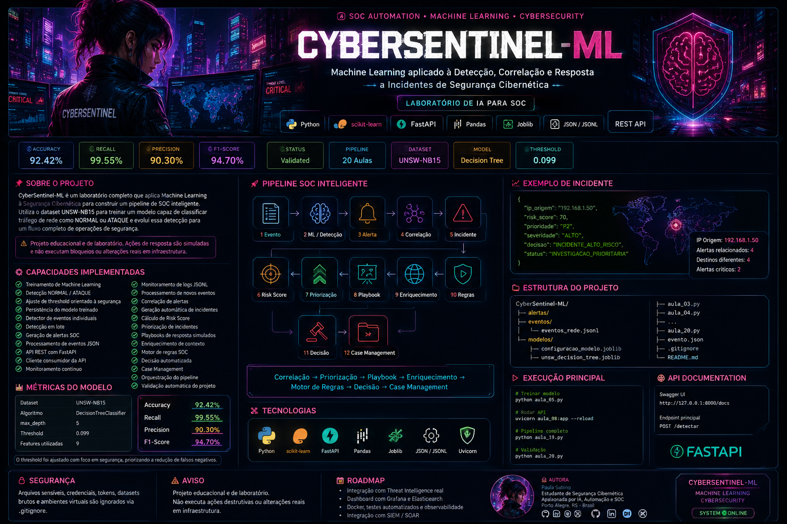

<div align="center">



# 🛡️ CyberSentinel-ML

### Machine Learning aplicado à Detecção, Correlação e Resposta a Incidentes de Segurança


**Cybersecurity • Machine Learning • Detection Engineering • SOC Automation**

`Version 1.0` • `Project Health: 100%` • `32/32 Validations`

</div>

---

## 🔎 Visão Geral

**CyberSentinel-ML** é um laboratório de Machine Learning aplicado à Segurança Cibernética, desenvolvido para demonstrar um pipeline completo de detecção e tratamento de eventos de rede.

O projeto utiliza o dataset **UNSW-NB15** e um modelo `DecisionTreeClassifier` para analisar características do tráfego e classificar eventos como:

```text
NORMAL
   ou
ATAQUE
```

A classificação de Machine Learning é apenas o início do processo.

Quando uma atividade suspeita é detectada, o CyberSentinel-ML pode transformar a detecção em um alerta SOC, correlacionar múltiplos alertas, gerar um incidente, calcular risco, definir prioridade, selecionar um playbook, enriquecer o contexto, aplicar regras de decisão e finalmente criar um caso para investigação.

> ⚠️ **Projeto educacional e de laboratório.**
>
> As ações de resposta são simuladas. O projeto não executa automaticamente bloqueios ou alterações destrutivas em infraestrutura real.

---

## 🧠 Arquitetura

```text
┌─────────────────────┐
│   EVENTO DE REDE    │
└──────────┬──────────┘
           │
           ▼
┌─────────────────────┐
│      API REST       │
│      FastAPI        │
└──────────┬──────────┘
           │
           ▼
┌─────────────────────┐
│  MACHINE LEARNING   │
│   Decision Tree     │
└──────────┬──────────┘
           │
           ▼
┌─────────────────────┐
│      DETECÇÃO       │
│  NORMAL / ATAQUE    │
└──────────┬──────────┘
           │
           ▼
┌─────────────────────┐
│       ALERTA        │
└──────────┬──────────┘
           │
           ▼
┌─────────────────────┐
│     CORRELAÇÃO      │
└──────────┬──────────┘
           │
           ▼
┌─────────────────────┐
│      INCIDENTE      │
└──────────┬──────────┘
           │
           ▼
┌─────────────────────┐
│     RISK SCORE      │
└──────────┬──────────┘
           │
           ▼
┌─────────────────────┐
│     PRIORIZAÇÃO     │
└──────────┬──────────┘
           │
           ▼
┌─────────────────────┐
│      PLAYBOOK       │
└──────────┬──────────┘
           │
           ▼
┌─────────────────────┐
│   ENRIQUECIMENTO    │
└──────────┬──────────┘
           │
           ▼
┌─────────────────────┐
│   MOTOR DE REGRAS   │
└──────────┬──────────┘
           │
           ▼
┌─────────────────────┐
│    DECISÃO FINAL    │
└──────────┬──────────┘
           │
           ▼
┌─────────────────────┐
│   CASE MANAGEMENT   │
└─────────────────────┘
```

---

# 🤖 Machine Learning Engine

O núcleo de detecção utiliza um modelo supervisionado treinado sobre dados do **UNSW-NB15**.

### Configuração atual

| Parâmetro | Valor |
|---|---|
| Dataset | UNSW-NB15 |
| Algoritmo | DecisionTreeClassifier |
| `max_depth` | 5 |
| Threshold | 0.099 |
| Features | 9 |
| Classificação | Binária |
| Classes | NORMAL / ATAQUE |

---

## 📊 Performance do modelo

| Métrica | Resultado |
|---|---:|
| 🎯 Accuracy | **92.42%** |
| 🔥 Recall | **99.55%** |
| 📌 Precision | **90.30%** |
| ⚡ F1-Score | **94.70%** |
| ❌ Falsos Negativos | **540** |
| ⚠️ Falsos Positivos | **12.755** |

O threshold utilizado pelo laboratório foi configurado em:

```text
0.099
```

A configuração prioriza sensibilidade de detecção, buscando reduzir a ocorrência de ataques classificados incorretamente como tráfego normal.

---

# 🔬 Features utilizadas

O modelo utiliza nove características do tráfego:

```text
01. spkts
02. dpkts
03. sbytes
04. dbytes
05. rate
06. sttl
07. dttl
08. sload
09. dload
```

Esses atributos são enviados ao modelo para produção da classificação e da probabilidade associada ao evento.

---

# ⚡ API de Detecção

O modelo pode ser consumido através de uma API REST desenvolvida com **FastAPI**.

### Endpoint

```http
POST /detectar
```

### Exemplo de evento

```json
{
  "spkts": 10,
  "dpkts": 2,
  "sbytes": 1500,
  "dbytes": 200,
  "rate": 120.0,
  "sttl": 254,
  "dttl": 64,
  "sload": 50000.0,
  "dload": 3000.0
}
```

### Exemplo de resposta

```json
{
  "classificacao": "ATAQUE",
  "probabilidade_ataque": 0.406258,
  "probabilidade_percentual": 40.63,
  "threshold": 0.099,
  "nivel_risco": "MEDIO",
  "modelo": "DecisionTreeClassifier"
}
```

---

# 🚨 Detection & Alert Engine

Depois da análise do modelo, eventos classificados como ataque podem gerar alertas SOC.

```text
NETWORK EVENT
      │
      ▼
 ML DETECTION
      │
      ▼
 ATTACK?
   │     │
  NÃO   SIM
   │     │
   ▼     ▼
NORMAL  ALERT
```

Os alertas preservam informações importantes para as etapas posteriores, incluindo:

- identificação do evento;
- timestamp;
- probabilidade;
- nível de risco;
- modelo utilizado;
- threshold;
- características originais do evento.

---

# 📡 Monitoramento contínuo

O projeto implementa processamento contínuo de eventos e monitoramento de logs no formato **JSONL**.

```text
eventos/eventos_rede.jsonl
           │
           ▼
       MONITOR
           │
           ▼
       API REST
           │
           ▼
      MODELO ML
           │
           ▼
       DETECÇÃO
           │
           ▼
      ALERTA SOC
```

O monitor também pode identificar **novas linhas adicionadas ao arquivo**, permitindo simular ingestão contínua de eventos.

---

# 🔗 Correlation Engine

Alertas isolados nem sempre representam todo o contexto de uma ameaça.

Por isso, o CyberSentinel-ML possui uma camada de correlação.

Exemplo:

```text
              192.168.1.50
                    │
       ┌────────────┼────────────┐
       │            │            │
       ▼            ▼            ▼
   10.0.0.10    10.0.0.20    10.0.0.30
                                    │
                                    ▼
                                10.0.0.50
```

Múltiplos alertas relacionados à mesma origem podem ser agrupados.

Exemplo de regra implementada:

```text
MULTIPLOS_ALERTAS_MESMA_ORIGEM
```

Resultado:

```text
4 ALERTAS
    ↓
1 INCIDENTE SOC
```

---

# 🎯 Risk Scoring

Depois da correlação, o incidente passa pelo mecanismo de cálculo de risco.

O pipeline considera diferentes informações, como:

```text
Probabilidade ML
Quantidade de alertas
Destinos diferentes
Alertas críticos
Reputação
Recorrência
Contexto
```

Exemplo produzido pelo laboratório:

```text
Risk Score: 70/100
Prioridade: P2
Severidade: ALTO
```

---

# 🚦 Priorização SOC

Os incidentes podem ser classificados operacionalmente em:

| Prioridade | Tratamento |
|---|---|
| 🔴 P1 | Emergencial |
| 🟠 P2 | Prioritário |
| 🟡 P3 | Análise |
| 🟢 P4 | Monitoramento |

Isso permite organizar uma fila de investigação semelhante ao fluxo utilizado em operações de SOC.

---

# 📕 Playbook Engine

Depois da priorização, o sistema seleciona uma resposta adequada ao nível do incidente.

Exemplo:

```text
INCIDENTE: INC-001

PRIORIDADE:
P2

AÇÃO:
ABRIR INVESTIGAÇÃO PRIORITÁRIA NO SOC

SLA:
30 minutos
```

Entre as recomendações geradas pelo laboratório estão:

```text
✓ Validar reputação do IP de origem
✓ Correlacionar eventos adicionais
✓ Verificar outros destinos relacionados
✓ Pesquisar atividade anterior do IP
✓ Escalar para resposta a incidente quando necessário
```

---

# 🌐 Context Enrichment

Antes da decisão final, o incidente recebe contexto adicional.

O enriquecimento pode considerar:

```text
Reputação do IP
Score de reputação
Ocorrências anteriores
Recorrência
Context Score
Threat Intelligence local
```

Exemplo:

```text
Reputação ............. SUSPEITO
Reputation Score ...... 80/100
Ocorrências ........... 7
Recorrência ........... ALTA
Context Score ......... 80/100
Context Level ......... CRITICO
```

---

# ⚙️ SOC Rules Engine

O Motor de Regras combina os diferentes sinais produzidos pelo pipeline.

Exemplo de decisão:

```text
Risk Score ............ 70/100
Context Score ......... 80/100
Reputation Score ...... 80/100
ML Probability ........ 67.00%

              ↓

Final Score ........... 75.05/100

              ↓

Decision:
INCIDENTE_ALTO_RISCO

Priority:
P2

Severity:
ALTO

Status:
INVESTIGACAO_PRIORITARIA
```

---

# 📂 Case Management

A decisão final pode resultar na criação automática de um caso SOC.

Exemplo:

```json
{
  "id_caso": "CASE-001",
  "id_incidente": "INC-001",
  "status": "ABERTO",
  "prioridade": "P2",
  "severidade": "ALTO",
  "score_final": 75.05,
  "fila": "SOC_PRIORITARIO",
  "responsavel": "SOC_L2",
  "sla_minutos": 30
}
```

O caso mantém informações como:

```text
✓ Evidências
✓ Prioridade
✓ Severidade
✓ Risk Score
✓ Responsável
✓ SLA
✓ Decisão SOC
✓ Ação recomendada
✓ Histórico de ações
```

---

# 🔄 Pipeline integrado

O projeto também possui uma camada de orquestração capaz de executar sequencialmente as principais etapas SOC.

```text
ETAPA 1
Correlação
    ↓
ETAPA 2
Priorização
    ↓
ETAPA 3
Playbook
    ↓
ETAPA 4
Enriquecimento
    ↓
ETAPA 5
Motor de Regras
    ↓
ETAPA 6
Case Management
```

Resultado da validação atual:

```text
Etapas previstas .......... 6
Etapas executadas ......... 6
Etapas com sucesso ........ 6
Etapas com erro ........... 0

STATUS:
PIPELINE CONCLUÍDO
```

---

# 🧪 Validação automática

O CyberSentinel-ML possui uma rotina de validação final do laboratório.

Ela verifica:

```text
✓ Diretórios
✓ Modelo de Machine Learning
✓ Configuração do modelo
✓ Scripts
✓ Artefatos SOC
✓ Pipeline integrado
✓ Case Management
```

### Resultado atual

```text
Validações realizadas ..... 32
Validações OK ............. 32
Validações com erro ....... 0

Saúde do projeto .......... 100.00%

STATUS FINAL:
PROJETO VALIDADO
```

---

# 🛠️ Stack

| Tecnologia | Aplicação |
|---|---|
| 🐍 Python | Core do projeto |
| 🤖 Scikit-learn | Machine Learning |
| 🌳 Decision Tree | Classificação |
| ⚡ FastAPI | API REST |
| 🚀 Uvicorn | Servidor ASGI |
| 🐼 Pandas | Processamento de dados |
| 💾 Joblib | Persistência do modelo |
| 📄 JSON | Eventos e artefatos |
| 📜 JSONL | Streaming de eventos |
| 📊 CSV | Resultados e alertas |

---

# 📁 Estrutura do projeto

```text
CyberSentinel-ML/
│
├── assets/
│   └── cybersentinel-banner.png
│
├── alertas/
│   ├── incidentes_aula_13.json
│   ├── incidentes_priorizados_aula_14.json
│   ├── respostas_aula_15.json
│   ├── incidentes_enriquecidos_aula_16.json
│   ├── decisoes_aula_17.json
│   ├── casos_aula_18.json
│   ├── relatorio_pipeline_aula_19.json
│   └── relatorio_final_aula_20.json
│
├── eventos/
│   └── eventos_rede.jsonl
│
├── modelos/
│   ├── configuracao_modelo.joblib
│   └── unsw_decision_tree.joblib
│
├── aula_03.py
├── aula_04.py
├── aula_05.py
├── aula_06.py
├── aula_07.py
├── aula_08.py
├── aula_09.py
├── aula_10.py
├── aula_11.py
├── aula_12.py
├── aula_13.py
├── aula_14.py
├── aula_15.py
├── aula_16.py
├── aula_17.py
├── aula_18.py
├── aula_19.py
├── aula_20.py
│
├── evento.json
├── .gitignore
└── README.md
```

---

# 🚀 Como executar

## 1. Clone o projeto

```bash
git clone https://github.com/Paula-Tech007/-CyberSentinel-ML.git
```

Entre no diretório:

```bash
cd -CyberSentinel-ML
```

---

## 2. Crie o ambiente virtual

```bash
python -m venv .venv
```

### Windows / PowerShell

```powershell
.\.venv\Scripts\Activate.ps1
```

---

## 3. Instale as dependências

```bash
pip install pandas scikit-learn fastapi uvicorn joblib requests
```

---

## 4. Inicie a API

```bash
uvicorn aula_08:app --reload
```

Documentação Swagger local:

```text
http://127.0.0.1:8000/docs
```

Health check:

```text
http://127.0.0.1:8000/health
```

---

## 5. Execute o pipeline SOC

Mantenha a API ativa e, em outro terminal:

```bash
python aula_19.py
```

---

## 6. Execute a validação

```bash
python aula_20.py
```

Resultado esperado para a versão atual:

```text
Saúde do projeto: 100.00%
Status: PROJETO VALIDADO
```

---

# 🛡️ Segurança do repositório

O projeto possui regras de `.gitignore` para evitar o versionamento acidental de arquivos locais e informações sensíveis.

Exemplos:

```gitignore
.venv/
venv/
__pycache__/

.env
.env.*
!.env.example

*.pem
*.key
*.p12
*.pfx

*.credentials
*.secret
*.secrets

.vscode/
.idea/
```

Antes da publicação, o projeto também pode ser verificado em busca de:

```text
password
passwd
token
api_key
secret
authorization
bearer
client_secret
access_key
```

---

# 🔐 Security by Design

O CyberSentinel-ML foi estruturado como laboratório defensivo.

```text
NO REAL BLOCKING
NO DESTRUCTIVE RESPONSE
NO PRODUCTION CREDENTIALS
NO AUTOMATIC INFRASTRUCTURE CHANGES

RESPONSE MODE:
SIMULATION
```

O objetivo é estudar **detecção, análise, correlação, priorização e automação defensiva**.

---

# 🗺️ Roadmap

### CyberSentinel-ML v1.x

- [x] Machine Learning
- [x] Detecção binária
- [x] Threshold customizado
- [x] Persistência do modelo
- [x] API REST
- [x] Monitoramento contínuo
- [x] JSONL Event Monitoring
- [x] Alert Engine
- [x] Correlation Engine
- [x] Incident Generation
- [x] Risk Scoring
- [x] Incident Prioritization
- [x] Playbook Engine
- [x] Context Enrichment
- [x] SOC Rules Engine
- [x] Case Management
- [x] Pipeline Orchestration
- [x] Project Validation

### Próximas evoluções

- [ ] Threat Intelligence externo
- [ ] Elasticsearch
- [ ] Grafana
- [ ] Dashboard SOC
- [ ] Docker
- [ ] Testes automatizados
- [ ] Persistência em banco de dados
- [ ] Observabilidade
- [ ] SIEM Integration
- [ ] SOAR Integration
- [ ] MITRE ATT&CK Mapping
- [ ] Evolução do Correlation Engine
- [ ] Comparação entre modelos ML
- [ ] Detecção multiclasse
- [ ] CyberSentinel-ML v2.0

---

# 📈 System Status

```text
╔════════════════════════════════════════════╗
║           CYBERSENTINEL-ML v1.0            ║
╠════════════════════════════════════════════╣
║                                            ║
║  ML ENGINE ................. READY         ║
║  REST API .................. READY         ║
║  DETECTION ENGINE .......... READY         ║
║  ALERT ENGINE .............. READY         ║
║  CORRELATION ENGINE ........ READY         ║
║  RISK ENGINE ............... READY         ║
║  PLAYBOOK ENGINE ........... READY         ║
║  CONTEXT ENGINE ............ READY         ║
║  RULES ENGINE .............. READY         ║
║  CASE MANAGEMENT ........... READY         ║
║                                            ║
║  PROJECT HEALTH ............ 100%          ║
║                                            ║
║  SYSTEM STATUS ............. VALIDATED     ║
║                                            ║
╚════════════════════════════════════════════╝
```

---

<div align="center">

# 👩‍💻 Paula Sabino

### Cybersecurity • Machine Learning • Security Automation • SOC

Projeto desenvolvido como laboratório prático de aplicação de **Machine Learning em operações defensivas de Segurança Cibernética**.

<br>

### 🛡️ CyberSentinel-ML

**From Network Events to SOC Decisions**

`DETECT` → `CORRELATE` → `PRIORITIZE` → `RESPOND`

<br>

**SYSTEM ONLINE**

</div>